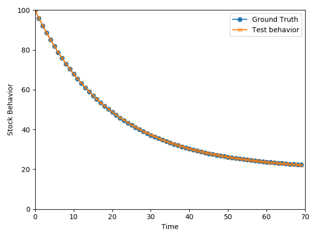

# Pytorch-SD

System dynamics and PyTorch

##Why this Repo?

This repo is set up as a part of the Machine Conceptualization project, its aim is to explore how deep-learning frameworks can be incorporated with system dynamics models.

The incorporation mentioned above, could happen on multiple levels.
 1) Model optimization (finding parameter values). This is not a new field, and features have already been built into main-stream SD software, like Vensim or Stella. But still not many of them have to do with neural networks.
 
 2) Model structure learning (finding potential structures). This application is relatively new, for example, Abdelbari and Shafi (2017) used Echo State Network (ESN, a type of RNN) to represent structures in stock and flow diagrams. The rationale behind this attempt, is the many similarities shared by SD models and neural networks.

This repo starts by trying to apply neural networks in model optimization (finding parameter values).

##SD Model in Neural Network
The execution of SD model could be seen as an iterative computation:
1) The model (connections and parameters) is defined.
2) Initial values for stocks and variables (here we differentiate non-stock variables from parameters) are specified.
3) Flows are calculated as functions of stocks, parameters and non-stock variables.
4) Stock values are changed based on their inflow and outflows.
5) Run again, until specified simulation period is reached.

In neural networks, especially in a round(step) of forward computation, output(result, i.e. the returned value) could be seen as a function of all inputs, parameters, etc. This analogy makes it possible to translate an iteration of SD simulation to a step of forward computation. In other words:

__flow = f(stock, parameters, non-stock variables)__

__output = f(input, parameters)__

PyTorch has built-in nn.Linear() function, which can be used in replicating operations in SD models.

##Finding Parameter Value by Training

####Method

Furthermore, we have the following analogy:

- Training a neural network is not much more than adjust the values of parameters, which is also the main task in model calibration.

- Groud truth is used in supervised learning to calculate a loss; historical data is used in finding values for parameters in SD model.

Inspired by but different from the method used in Abdelbari and Shafi (2017), historical data of stock and flow are used as input and output in training. One iteration in SD model can yield a new set of value(s) for flow(s), which in this training process is the output and then used to calculate the loss against the groud truth (read value for a flow). Based on this loss, through back-propagate function, parameters are subsequently adjusted. Such an adjustment, although subject to hugh stochasticity, will likely be converging to a state where the loss is reduced to a very small value. By this time, the parameters in the network, might be the values we are looking for.

####An Example
In a first-order negative feedback loop structure, two parameters are of key importance: the goal and the adjustment time. In this example, these 2 parameters in a first order feedback loop structure are tuned based on time-series data.

The time-series data is obtained through a simulation of such a first-order negative feedback loop model (with goal-seeking behavior) using Stella. They are used here as ground truth.

Ground truth and simulation behavior from using calibrated parameters are presented in the following graph (instead of using stock-flow scatters, stock-behavior over time is used to make more intuitive sense):



As shown in the graph, the calibrated parameters are able to generate behavior very close to the ground truth.

Just as shown in the output:
```
[Parameter containing:
tensor([[1.9785]], requires_grad=True), Parameter containing:
tensor([[0.1985]], requires_grad=True)]
```
The learned 'goal' is 1.9785 * 10 = 19.785, close to 20, which is the parameter 'goal' in the SD model;

The learned 'adjustment time' is 0.1985, close to 0.2 or 1/5, of which 5 is the parameter 'adjustment time' in the SD model.

##Guidance to Use

Requirements:

- Python3
- Pytorch
- Pandas
- Matplotlib

Clone this repo to a local place:

`git clone https://github.com/Rutherford1895/Pytorch-SD.git`

Run the main script:

`python find_parameter_value.py`

##Acknowledgement
The idea of this attempt emerged as a by-product in a discussion with Dr. D.Arango. Tusen takk! (Although the 'main idea' is still on its way to realization)

##Reference
1) Abdelbari, H., & Shafi, K. (2017). A computational Intelligence‐based Method to ‘Learn’Causal Loop Diagram‐like Structures from Observed Data. System Dynamics Review, 33(1), 3-33.